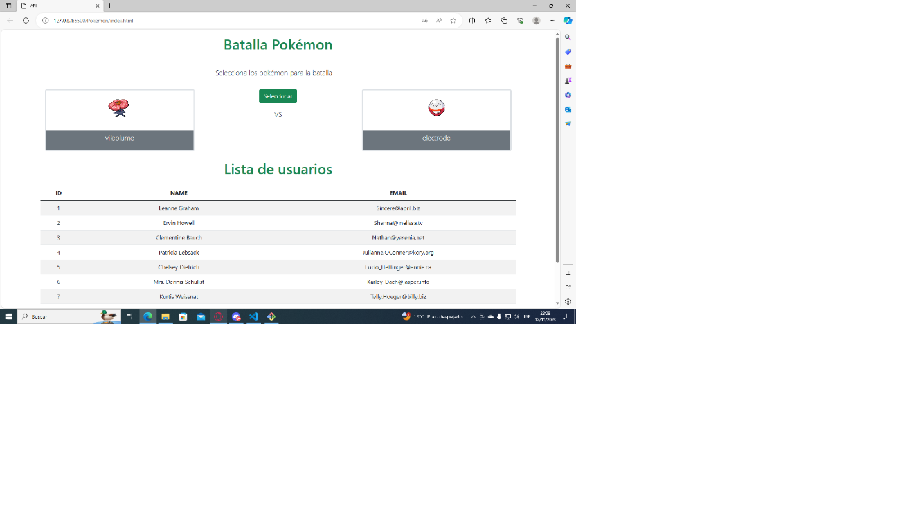

# Pokemon
# Integrantes

1. Jared Valenzuela
2. Joseph Yépez
3. Alejandro Moreira
4. Heyer Tinoco
5. Juan Falconi
6. Juan Gualotuña
7. Miguel Paredes

# Contenido del Repositorio:
index.html: Define la estructura HTML para la página, incluyendo secciones para la batalla Pokémon y la lista de usuarios. Enlaza hojas de estilo y scripts de JavaScript.
Users.js: Contiene funciones para obtener datos de usuarios desde la API jsonplaceholder.typicode.com y mostrarlos en una tabla.
Pokemon.js: Implementa funciones para consultar la API pokeapi.co y mostrar detalles de Pokémon en la interfaz, así como para la selección aleatoria de Pokémon para la batalla.

